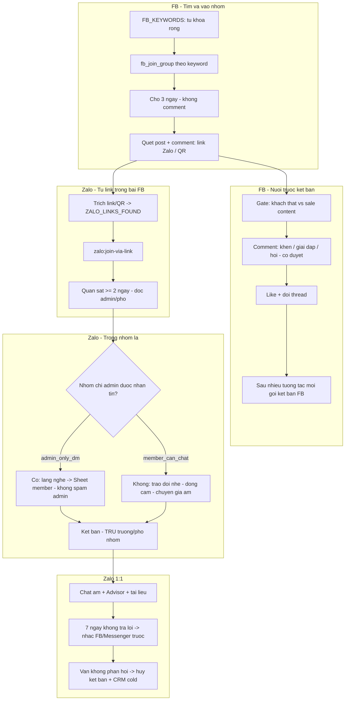

# Workflow FB → Zalo — Nuôi lead đa vertical (v1.0)

> **Mục đích**: Chuẩn vận hành go-live — cách tìm lead, tương tác như người thật, kéo sang Zalo, chăm sóc và chuyển đổi. Bổ sung cho [README.md](./README.md) (P0–P7 kỹ thuật).
>
> **Trạng thái**: Đã chốt quy tắc vận hành (2026-06-04). Phần code: một số bước **chưa implement** — xem mục 8.

---

## 1. Triết lý (đã chốt)

| Nguyên tắc | Chi tiết |
|------------|----------|
| Facebook nhóm | Sân **tìm lead + tạo quen** — không chốt tài liệu dự án tại FB |
| Zalo | Kênh **chăm ấm**, gửi file, tư vấn — lý do kéo Zalo sau khi đã có tương tác |
| Không coi nhóm “đối thủ” | Cạnh tranh ngầm — **tinh tế**, đồng hành, không “cướp khách” lộ liễu |
| Đa số tương tác là sale BĐS | Vẫn tương tác để **lọc khách thật** (`likely_buyer` vs `likely_agent`) |
| Từ khóa rộng | Thẩm mỹ, đầu tư, làm đẹp… — nhu cầu ẩn về nhà/vay/thẩm định |
| Nhóm Zalo “nhà” | **Chưa có** — tạo sau; tạm không mời vào nhóm sản phẩm |

---

## 2. Sơ đồ tổng thể

---

## 3. Facebook — chi tiết từng bước

### 3.1 Tìm & tham gia nhóm

- **Nguồn từ khóa**: tab `FB_KEYWORDS` (không chỉ “bất động sản”).
- **Hành động**: `fb_search_groups` / `fb_join_group` (executor) — ghi `FB_GROUPS_JOINED`.
- **Sau khi join**: **chờ 3 ngày** (`first_comment_after = joined_at + 3`) mới comment đầu tiên.

### 3.2 Quét bài trong nhóm đã join

- Đọc post + comment; trích:
  - Link text: `zalo.me/g/...`, `join.zalo.me/...`
  - Ảnh QR (giai đoạn 1: thủ công hoặc vision — chưa bắt buộc auto)
- Ghi tab `ZALO_LINKS_FOUND` + post nguồn (`fb_post_url`).

### 3.3 Comment trước kết bạn (bắt buộc)

| Loại tương tác | Khi nào |
|----------------|---------|
| Lời khen / đồng thuận | Bài chia sẻ kinh nghiệm, thành công |
| Giải thích | Câu hỏi pháp lý, vay, khu vực (nhẹ, không bịa số) |
| Hỏi mở | Thể hiện quan tâm, mời họ chia sẻ thêm |
| Reply comment khác | Gây chú ý trong thread — không chỉ 1 dòng đơn |

**Cổng AI (cần bổ sung P6):**

- `likely_buyer` — ưu tiên comment + theo dõi
- `likely_agent` — tương tác nhẹ (mạng lưới) hoặc skip nếu quota thấp
- `unclear` — quan sát thêm

**Human-in-the-loop**: `approved=FALSE` → chỉ draft.

### 3.4 Kết bạn Facebook

- **Không** ngay sau 1 comment.
- Chỉ sau: đã tương tác thread + (tuỳ chính sách) thêm 1–3 ngày.
- Lời nhắn kết bạn: nhắc ngữ cảnh đã comment (“em thấy anh/chị hỏi về… em kết bạn để tiện trao đổi”).

---

## 4. Zalo — từ link trong bài Facebook

### 4.1 Tham gia nhóm

- Join qua link đã trích — **không** tìm nhóm Zalo bằng từ khóa.
- Ghi `joined_at`, `observe_until = joined_at + 2 ngày` (tối thiểu).

### 4.2 Giai đoạn quan sát (≥ 2 ngày)

**Bắt buộc đọc trước khi chat/comment trong nhóm:**

- Nội quy / thông báo **Trưởng nhóm**, **Phó nhóm**
- Chủ đề họ đang “bật” (câu hỏi, khảo sát, mini-game)

**Không** quá phô trương — tránh admin nghi “vào lấy khách”.

### 4.3 Hai chế độ nhóm Zalo

| Chế độ | Nhận biết | Hành vi |
|--------|-----------|---------|
| **A — Admin-only DM** | Chỉ trưởng/phó được nhắn tin / nội quy cấm inbox member | **Lắng nghe**, export member/context → Sheet; kết bạn & kéo **âm thầm**; **không** cãi admin; vẫn **học hỏi** nội dung nhóm |
| **B — Member chat được** | Thành viên chat bình thường | Sau quan sát: trao đổi **nhẹ** — đồng cảm, chia sẻ, chuyên gia **âm thầu** (không CTA cứng) |

### 4.4 Nhận diện admin

- Zalo PC hiển thị **Trưởng nhóm / Phó nhóm** khi vào nhóm.
- Executor cần đọc role → cột `role` trên `ZALO_GROUP_MEMBERS`: `admin | deputy | member`.
- **Không** gửi lời mời kết bạn tới `admin` / `deputy` (trừ khi human override).

### 4.5 Kết bạn & chuyển sang nhóm “nhà”

- Kết bạn sau khi đã có ngữ cảnh trong nhóm (hoặc từ Sheet member ở chế độ A).
- **Nhóm Zalo của bạn**: chưa tạo → workflow **tạm dừng** bước `zalo:add_to_our_group`; chỉ 1:1 + CRM.

---

## 5. Zalo 1:1 — chăm sóc & hủy kết bạn

### 5.1 Khi nào nhắn

- Lead **ấm**: đã tương tác FB/Zalo nhóm, hoặc có nhu cầu rõ (hỏi giá, vay, khu vực).
- Dùng **Advisor (P3)** + KB dự án — gửi tài liệu (điểm mạnh Zalo).

### 5.2 Không phản hồi — quy trình 7 ngày (đã chốt)

| Ngày | Hành động |
|------|-----------|
| 0 | Gửi tin Zalo (đã duyệt) |
| 1–6 | Chờ phản hồi |
| 7 | Nếu **không** phản hồi **và** có Facebook: nhắc trên **FB hoặc Messenger** (không hủy âm thầm) |

**Mẫu nhắc FB/Messenger:**

> Em có gửi lời mời kết bạn Zalo để tiện chia sẻ thông tin, em chưa được chấp nhận. Anh/chị kiểm tra Zalo giúp em khi rảnh ạ.

| Sau nhắc | Hành động |
|----------|-----------|
| Vẫn không phản hồi thêm X ngày (đề xuất 3–7) | `unfriend` Zalo + CRM `status=cold` + `unfriend_reason=no_reply` |
| Không có FB | Không hủy ngay ngày 7 — ghi CRM, human quyết định |

**Cấm:** hủy kết bạn khi **chưa** thử kết nối lại FB (nếu có liên kết FB).

---

## 6. Google Sheet — tab bổ sung

| Tab | Vai trò |
|-----|---------|
| `FB_KEYWORDS` | `keyword`, `vertical`, `priority`, `enabled` |
| `FB_GROUPS_JOINED` | Nhóm đã join + `joined_at`, `first_comment_after` |
| `ZALO_LINKS_FOUND` | Link/QR từ post FB |
| `ZALO_GROUP_CONTEXT` | Tóm tắt nội quy + chủ đề admin (Claude) |
| `ZALO_GROUP_MEMBERS` | `display_name`, `role`, `likely_role`, `friend_status`, `has_facebook` |
| `FRIEND_FOLLOWUP` | Lời mời KB, ngày gửi, nhắc FB đã gửi chưa, unfriend_at |

Template CSV: xem [templates/README_IMPORT.md](./templates/README_IMPORT.md).

---

## 7. CONFIG — quota & delay (bổ sung đề xuất)

| platform | action | Gợi ý go-live |
|----------|--------|----------------|
| facebook | join_group | 2–3 / ngày / acc |
| facebook | comment | 10–15 / ngày (sau ngày 3) |
| facebook | friend_request | 3–5 / ngày (chỉ sau nurture) |
| zalo | join_group_via_link | 1–2 / ngày |
| zalo | group_observe_days | min 2 (rule, không phải HTTP) |
| zalo | add_friend | 10–15 / ngày (trừ admin) |
| zalo | unfriend | 5–10 / ngày (sau quy trình nhắc FB) |

File mẫu: `templates/05_CONFIG_QUOTA_DELAY.csv` (đã thêm dòng gợi ý).

---

## 8. Trạng thái implement (code)

| Bước | Pipeline / Executor |
|------|---------------------|
| FB join group + keyword rộng | Executor `fb_join_group` ✅ — CLI pipeline ⏳ |
| Chờ 3 ngày trước comment | Rule Sheet ⏳ (orchestrator) |
| Gate likely_buyer / agent | P6 `commentGenerator` ⏳ |
| Trích link Zalo từ post FB | ⏳ `fb:scan-zalo-links` |
| Join Zalo qua link | ⏳ `zalo:join-via-link` |
| Đọc admin/phó nhóm | ⏳ executor |
| Comment trong nhóm Zalo | ⏳ (chỉ quan sát đã chốt; chat nhẹ sau) |
| Harvest member (admin-only nhóm) | ⏳ |
| Unfriend + nhắc FB trước | ⏳ |
| Nhóm Zalo nhà | 🔜 sau khi bạn tạo nhóm |

---

## 9. Thứ tự triển khai code (đề xuất)

1. Template Sheet + orchestrator rule (3 ngày / 2 ngày) — không cần Playwright.
2. P6 gate `likely_buyer` / `likely_agent`.
3. `fb:scan-zalo-links` + tab `ZALO_LINKS_FOUND`.
4. `zalo:join-via-link` + đọc role admin.
5. `zalo:friend-from-group` + `FRIEND_FOLLOWUP` + nhắc FB.
6. Nhóm Zalo “nhà” khi bạn sẵn sàng → `zalo:add_to_our_group`.

---

*Liên hệ kỹ thuật: `tools/workflow-bds-pipeline`, `tools/bds-executor-service`.*
